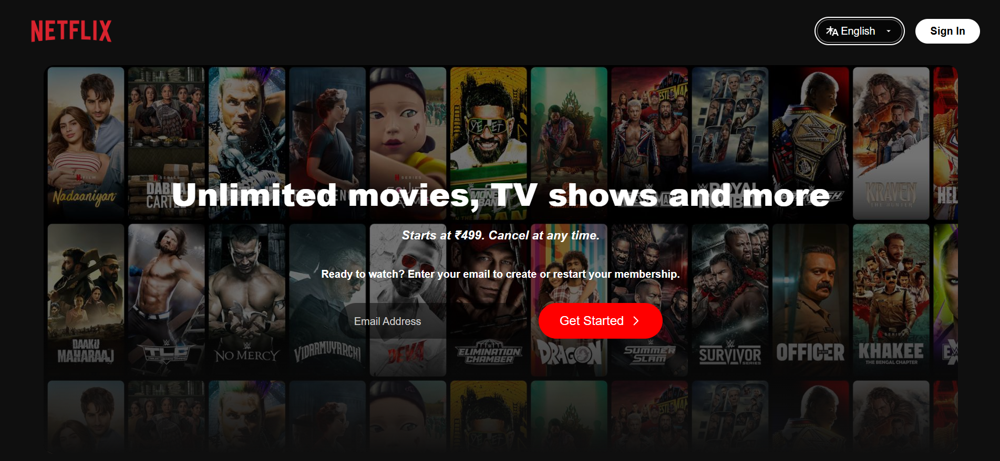

🎬 Netflix Clone (HTML & CSS)
A responsive front-end clone of Netflix built using only HTML and CSS. This project replicates the landing page of Netflix to practice layout, styling, and responsiveness with zero JavaScript.

📸 Demo

🚀 Features
Fully interactive landing page

Hero section with background image and CTA

Sign-in button(non-functional)

FAQ accordion-style layout using only HTML & CSS

Footer with links

🛠 Built With
HTML5

CSS3 (Flexbox, Grid, Media Queries)

No JavaScript, No Frameworks

📁 Project Structure
markdown
Copy
Edit
netflix-clone/
├── index.html
├── style.css
└── assets/
    └── images/
🧠 What I Learned
Positioning elements with Flexbox & Grid

Building responsive layouts with media queries

Using CSS pseudo-classes for hover and focus effects

Creating a clean, Netflix-inspired design from scratch

Understanding how to manipulate values to replicate the netflix homepage helped me gain an intuitive understanding of html elements and the css syntax

📦 How to Use

Clone this repository:

bash
Copy
Edit
git clone https://github.com/your-username/netflix-clone.git

Open index.html in your browser:
bash
Copy
Edit
cd netflix-clone
open index.html

📝 License
This project is for educational purposes only. Netflix is a trademark of Netflix, Inc.
This clone is not intended for commercial use.

